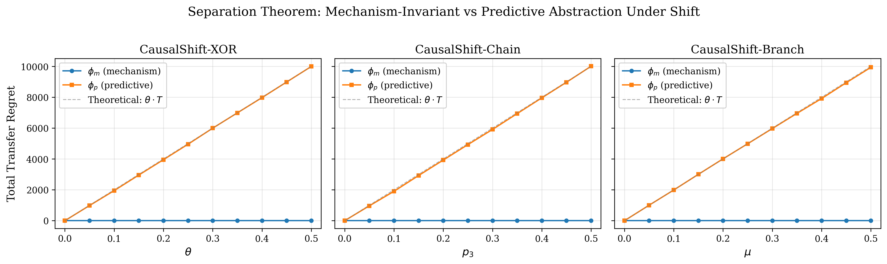
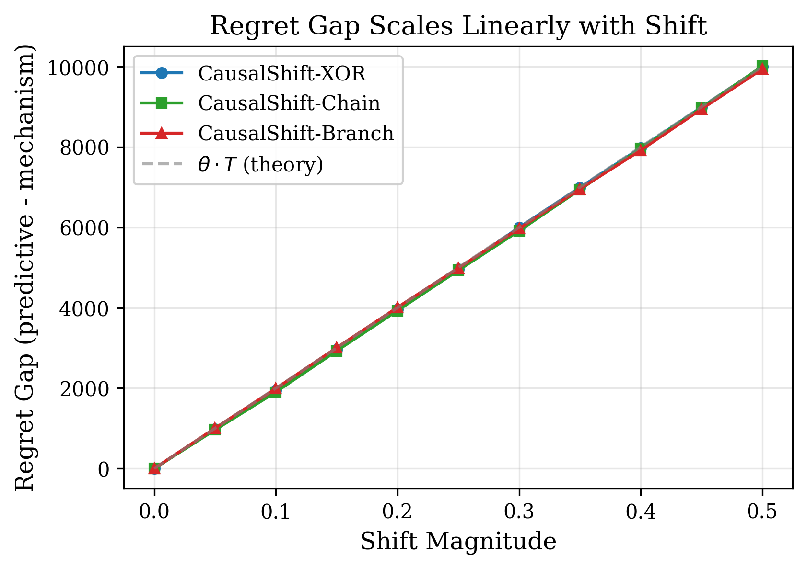
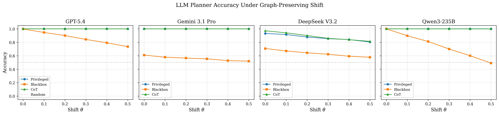
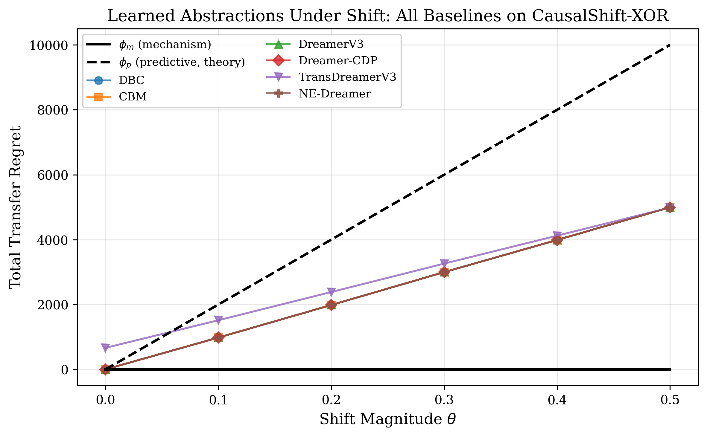
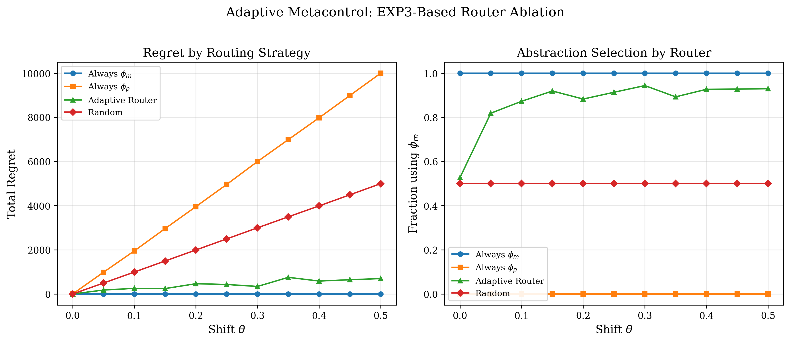
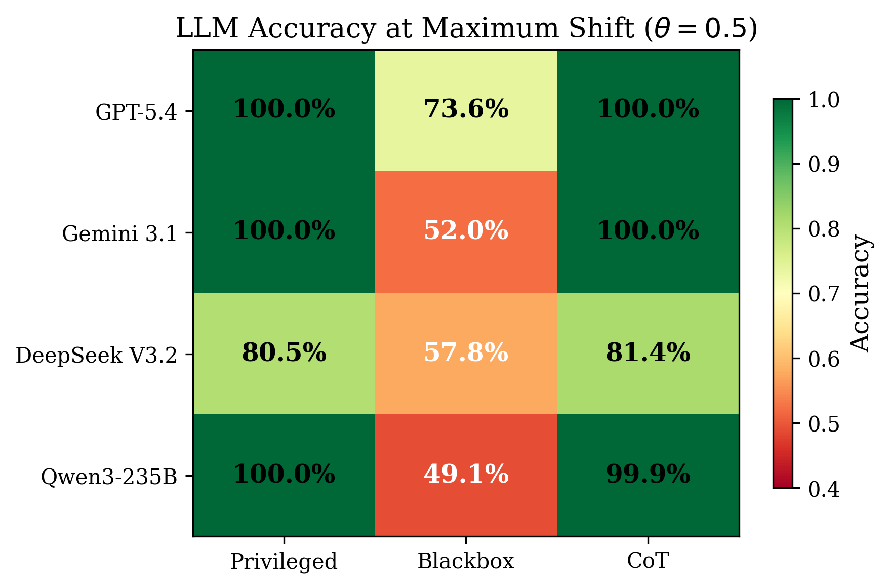

# The Cost of Counterfactuals

**A Separation Theorem for Transfer-Robust Abstraction in Modular Decision Processes**

[]()
[](LICENSE)
[]()
[]()

---

## Overview

We prove a **constructive separation theorem** showing that two state abstractions with identical source-environment trajectory distributions can exhibit radically different transfer behavior under graph-preserving shift:

- The **mechanism-invariant abstraction** $\phi_m$ achieves zero transfer regret
- The **predictive abstraction** $\phi_p$ suffers $\Theta(\theta \cdot T)$ linear regret
- No amount of source data can distinguish $\phi_m$ from $\phi_p$

We formalize the **counterfactual cost** as the minimal overhead for mechanism invariance, and validate our theory across **15 baselines** spanning frontier LLMs, world models, and causal RL methods.

## Separation Theorem (Informal)

> **Theorem 1.** For any modular SCM-MDP with graph-preserving shift family $\Theta$, there exist abstractions $\phi_m, \phi_p$ such that:
> 1. $D_{\text{source}}(\phi_m) = D_{\text{source}}(\phi_p)$ &nbsp;*(identical source distributions)*
> 2. $\text{Regret}(\phi_m, \theta) = 0$ &nbsp; $\forall \theta \in \Theta$
> 3. $\text{Regret}(\phi_p, \theta) = \Theta(\theta \cdot T)$

The construction uses a 2-component SCM where $S_1 \to S_2$, with $S_2 = S_1 \oplus \text{Bernoulli}(\theta)$. At source ($\theta = 0$), both variables carry identical information. Under shift, $S_2$ becomes a noisy copy of the causal variable $S_1$.

## Key Results

| Method | Type | Source ($\theta$=0) | Shifted ($\theta$=0.5) | Behavior |
|--------|------|:-------------------:|:----------------------:|----------|
| $\phi_m$ (mechanism-invariant) | Theory | 0 regret | **0 regret** | Transfer-robust |
| $\phi_p$ (predictive) | Theory | 0 regret | $\theta \cdot T$ regret | Transfer-fragile |
| DBC, CBM | Causal RL | 0 regret | ~$\theta \cdot T$ regret | Learn $\phi_p$ |
| DreamerV3, CDP, Trans, NE | World Models | 0 regret | ~$\theta \cdot T$ regret | Learn $\phi_p$ |
| GPT-5.4, Gemini 3.1 Pro (privileged) | LLM | 100% acc | **100% acc** | Act like $\phi_m$ |
| LLMs (blackbox) | LLM | 50--100% | 49--74% | Between $\phi_m$ and $\phi_p$ |

## Empirical Validation

All experiments use **30 random seeds** with **95% confidence intervals**. Results are fully reproducible from the included scripts and pre-computed in `results/`.

### Separation Across Three Environments


*Figure 3: Total transfer regret vs shift magnitude across CausalShift-XOR, Chain, and Branch. $\phi_m$ (blue) maintains zero regret at all shift levels; $\phi_p$ (orange) grows linearly, matching the theoretical prediction $\theta \cdot T$ (dashed).*

### Regret Gap Scaling


*Figure 4: The regret gap ($\phi_p - \phi_m$) scales linearly with shift magnitude across all three environments, confirming Theorem 1.*

### LLM Baselines (4 Models x 3 Conditions)


*Figure 5: LLM accuracy under shift. Privileged/CoT conditions (told that $S_1$ is the cause) achieve near-perfect accuracy. Blackbox conditions degrade, with Qwen3-235B perfectly tracking $S_2$ ($\phi_p$ behavior).*

### GPU Baselines (6 Methods)


*Figure 6: All learned representations (DBC, CBM, DreamerV3, Dreamer-CDP, TransDreamerV3, NE-Dreamer) converge to $\phi_p$ behavior under shift.*

### Adaptive Router Ablation


*Figure 7: EXP3-based router converges to 93% $\phi_m$ usage under maximal shift, achieving 93% regret reduction vs $\phi_p$.*

### Summary Heatmap


*Figure 8: LLM accuracy at maximum shift ($\theta = 0.5$) across models and conditions.*

## CausalShift Benchmark

Three environments implementing modular SCM-MDPs with graph-preserving shift:

| Environment | DAG Structure | State | Shift Parameter | Abstraction Split |
|-------------|---------------|-------|-----------------|-------------------|
| **XOR** | $S_1 \to S_2$ | $\{0,1\}^2$ | $\theta$: noise on $S_1 \to S_2$ | $\phi_m = S_1$, $\phi_p = S_2$ |
| **Chain** | $X_1 \to \cdots \to X_5$ | $\{0,1\}^5$ | $p_3$: noise at mid-chain | $\phi_m = (X_1, X_2)$, $\phi_p = (X_4, X_5)$ |
| **Branch** | $X_1 \to \{X_2, X_3\} \to X_4$, $U \to \{X_2, X_3\}$ | $\{0,1\}^4$ + hidden $U$ | $\mu$: confounder probability | $\phi_m = X_1$, $\phi_p = X_4$ |

## Repository Structure

```
causalshift/                        # Core library (pip install -e .)
├── envs/                           # CausalShift benchmark environments
│   ├── xor.py                      # CausalShift-XOR (theorem construction)
│   ├── chain.py                    # CausalShift-Chain (5-component scaling)
│   ├── branch.py                   # CausalShift-Branch (hidden confounder)
│   └── registry.py                 # Gymnasium registration
├── abstractions/                   # State abstraction implementations
│   ├── base.py                     # Abstract base class
│   ├── mechanism_invariant.py      # phi_m: tracks causal variables
│   └── predictive.py               # phi_p: tracks effect variables
├── baselines/                      # Baseline implementations
│   ├── ucb_abstract.py             # UCB1 learner on abstract MDPs
│   ├── dbc_baseline.py             # Deep Bisimulation for Control
│   ├── cbm_baseline.py             # Causal Bisimulation Modeling
│   └── llm_planner.py              # LLM planners (GPT-5.4, Gemini, DeepSeek, Qwen)
└── router/                         # Adaptive metacontrol
    └── adaptive.py                 # EXP3-based abstraction router

experiments/                        # Reproducible experiment scripts
├── full_separation.py              # Separation theorem (3 envs x 11 shifts x 30 seeds)
├── xor_separation.py               # XOR separation with UCB learning
├── gpu_baselines.py                # DBC/CBM training + transfer
├── llm_baselines.py                # Parallel LLM evaluation (15k+ API calls)
└── router_experiment.py            # Router ablation (4 strategies)

notebooks/                          # Self-contained GPU scripts (Kaggle / Lightning AI)
├── dreamerv3_baseline.py           # DreamerV3 (reconstruction-based)
├── dreamer_cdp_baseline.py         # Dreamer-CDP (JEPA-style, no decoder)
├── trans_dreamer_baseline.py       # TransDreamerV3 (transformer encoder)
└── ne_dreamer_baseline.py          # NE-Dreamer (next-embedding prediction)

analysis/                           # Figure generation
├── plot_separation.py              # Figures 3-4
└── plot_all_results.py             # Figures 5-8 + statistical summary

results/                            # Pre-computed results (JSON)
├── full_separation/                # 3 envs x 11 shifts x 30 seeds
├── llm/                            # 4 models x 3 conditions (15k calls each)
├── gpu/                            # 10 baseline runs (30 seeds each)
├── router/                         # 4 strategies x 11 shifts x 30 seeds
└── statistical_summary.json        # Aggregate statistics

figures/                            # Publication-ready (PDF + PNG)
tests/                              # Unit tests (pytest)
```

## Reproduction

```bash
# Install
pip install -e .

# Run tests
pytest tests/ -v

# Reproduce separation theorem (3 envs, 30 seeds, ~5 min)
python experiments/full_separation.py --seeds 30 --output results/full_separation

# Reproduce router ablation (30 seeds, ~3 min)
python experiments/router_experiment.py --seeds 30 --output results/router

# Reproduce GPU baselines — DBC and CBM (30 seeds each, ~20 min)
python experiments/gpu_baselines.py --baseline dbc --env xor --seeds 30 --output results/gpu
python experiments/gpu_baselines.py --baseline cbm --env xor --seeds 30 --output results/gpu

# Generate all figures from results
python analysis/plot_all_results.py
```

### LLM Baselines

Requires API credentials and the `[llm]` extras:

```bash
pip install -e ".[llm]"

# Example: GPT-5.4 privileged condition (50 parallel workers)
python experiments/llm_baselines.py \
    --model gpt-5.4 \
    --condition privileged \
    --seeds 5 \
    --workers 50 \
    --output results/llm
```

**Supported models**: `gpt-5.4`, `gemini-3.1-pro`, `deepseek-v3.2`, `qwen3-235b`
**Conditions**: `privileged` (told causal structure), `blackbox` (no info), `cot` (causal info + chain-of-thought)

### World Model Baselines

Scripts in `notebooks/` are self-contained (include environment code inline) and run on any NVIDIA GPU. Designed for Kaggle Notebooks or Lightning AI.

## Citation

```bibtex
@article{singh2026cost,
  title={The Cost of Counterfactuals: A Separation Theorem for Transfer-Robust
         Abstraction in Modular Decision Processes},
  author={Singh, Panavin},
  year={2026}
}
```

## License

[MIT](LICENSE)
